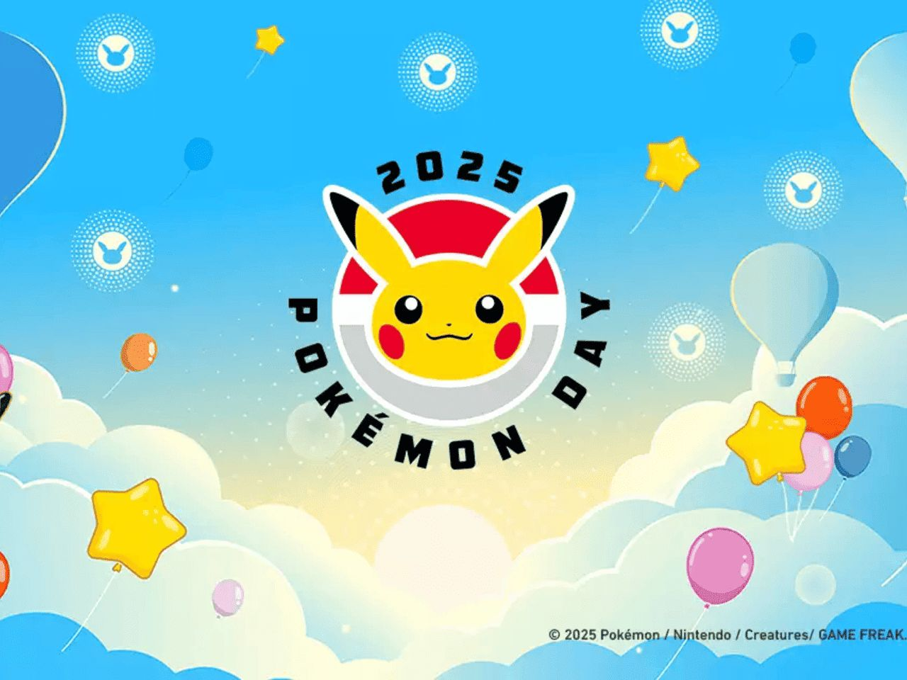

# Achadinhos Pokémon

Landing page simples (HTML/CSS/JS puro, sem build, sem framework) para converter
visitantes em membros do grupo do WhatsApp de cupons e achadinhos de cartas Pokémon.

## Como editar o link do WhatsApp

Abra [script.js](script.js) e troque a constante `WHATSAPP_LINK` pelo link real
do seu grupo/comunidade (ex: `https://chat.whatsapp.com/XXXXXXXXXXXXXXXXXXXXXX`).
Todos os botões da página usam esse mesmo valor — não precisa editar o HTML.

## Como exibir o número de membros

Em [script.js](script.js), preencha a constante `MEMBER_COUNT` com o número real
de membros do grupo (ex: `"12.500"`) para o selo de prova social aparecer ao lado
do botão no hero. Deixe em branco (`""`) para manter o selo oculto — evite números
inventados, isso quebra a confiança de quem visita a página.

## Como trocar o avatar do grupo

O hero usa um ícone de pokébola em SVG como placeholder no lugar da foto/logo do
grupo. Quando tiver a arte oficial, abra [index.html](index.html), procure o
comentário `Avatar do grupo` dentro de `.avatar` e troque o `<svg>` por:

```html

```

## Rodar localmente

Não precisa de instalação nem build. Basta abrir `index.html` no navegador,
ou usar qualquer servidor estático, por exemplo:

```bash
npx serve .
```

## Deploy na Vercel (grátis)

1. Suba esta pasta para um repositório no GitHub.
2. Acesse [vercel.com/new](https://vercel.com/new) logado com a mesma conta
   usada nos outros projetos.
3. Importe o repositório. A Vercel detecta automaticamente que é um site
   estático — não precisa configurar build command nem output directory.
4. Clique em Deploy. Pronto, o site fica em `https://<nome-do-projeto>.vercel.app`.

## Aviso

Site não afiliado à Pokémon Company, Nintendo, Game Freak ou Creatures Inc.
Apenas promove um grupo de avisos de promoções de terceiros.
